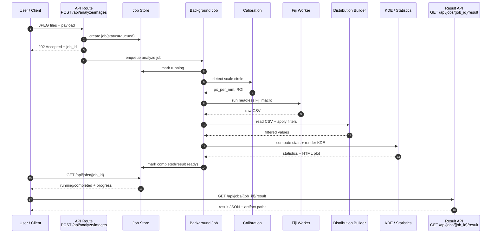
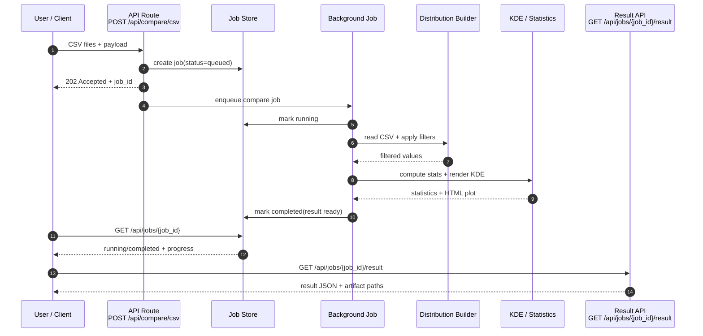
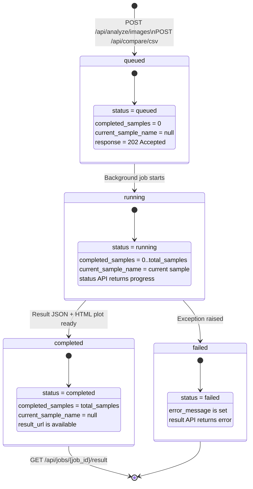

# GrindGuide Mermaid Diagrams

この資料は、`C4_model_target.md` を補助するための Mermaid 図集です。

- コンテナの関係
- `analyze/images` の処理フロー
- `compare/csv` の処理フロー
- ファイル入出力と成果物

## 1. Container Diagram

```mermaid
flowchart LR
    User[User / Client]

    subgraph API[API Container]
        AnalyzeRoute[POST /api/analyze/images]
        CompareRoute[POST /api/compare/csv]
        JobRoute[GET /api/jobs/{job_id}\nGET /api/jobs/{job_id}/result]
    end

    subgraph JobMgmt[Job Management Container]
        JobStore[In-memory Job Store]
        Pipeline[Background Job Pipeline]
    end

    subgraph Measure[Measurement Containers]
        Calibration[Calibration Container]
        Fiji[Fiji Worker Container]
        Distribution[Distribution Builder Container]
        KDE[KDE / Statistics Container]
        Bundle[Result Bundle Builder]
    end

    subgraph TempFS[Temporary Workspace]
        Uploads[Uploaded JPEG / CSV]
        RawCsv[Raw Measurement CSV]
        Plot[KDE HTML / SVG]
        ResultJson[Result JSON]
    end

    User --> AnalyzeRoute
    User --> CompareRoute
    User --> JobRoute

    AnalyzeRoute --> JobStore
    CompareRoute --> JobStore
    AnalyzeRoute --> Pipeline
    CompareRoute --> Pipeline

    Pipeline --> Uploads
    Pipeline --> Calibration
    Calibration --> Fiji
    Fiji --> RawCsv
    RawCsv --> Distribution
    Uploads --> Distribution
    Distribution --> KDE
    KDE --> Plot
    Distribution --> Bundle
    KDE --> Bundle
    Plot --> Bundle
    Bundle --> ResultJson

    JobStore --> JobRoute
    ResultJson --> JobRoute
```

## 2. Analyze Sequence



## 3. Compare Sequence



## 4. File and Result I/O

```mermaid
flowchart TD
    RequestAnalyze[POST /api/analyze/images]
    RequestCompare[POST /api/compare/csv]

    subgraph AnalyzeWorkspace[tmp/analyze/{job_id}]
        AnalyzeInput[IMG_7066.jpg / IMG_7084.jpg]
        AnalyzeRawCsv[IMG_7066_raw.csv\nIMG_7084_raw.csv]
        AnalyzePlot[feret_kde.html]
    end

    subgraph CompareWorkspace[tmp/compare/{job_id}]
        CompareInput[Results_7084.csv\nResults_7066.csv]
        ComparePlot[feret_kde.html]
    end

    RequestAnalyze --> AnalyzeInput
    AnalyzeInput --> AnalyzeRawCsv
    AnalyzeRawCsv --> AnalyzePlot

    RequestCompare --> CompareInput
    CompareInput --> ComparePlot

    AnalyzeRawCsv --> AnalyzeResult[Analyze result JSON]
    AnalyzePlot --> AnalyzeResult

    CompareInput --> CompareResult[Compare result JSON]
    ComparePlot --> CompareResult

    AnalyzeResult --> ResultAPI1[GET /api/jobs/{job_id}/result]
    CompareResult --> ResultAPI2[GET /api/jobs/{job_id}/result]
```

## 5. Job State Model



### State Response Fields

- `job_id`
- `job_type`
- `status`
- `total_samples`
- `completed_samples`
- `current_sample_name`
- `created_at`
- `started_at`
- `completed_at`
- `error_message`

## 6. Job ID Convention

```text
analyze_YYYYMMDDThhmmssZ_xxxxxxxx
compare_YYYYMMDDThhmmssZ_xxxxxxxx
```

- prefix: `analyze` または `compare`
- timestamp: UTC 作成時刻
- suffix: `uuid4().hex[:8]`
